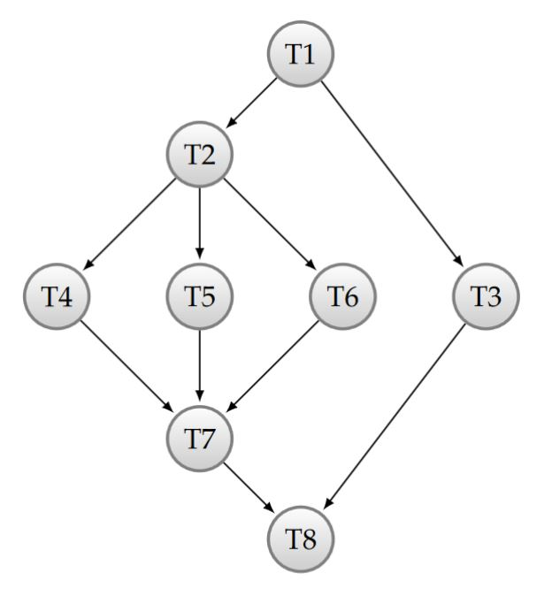
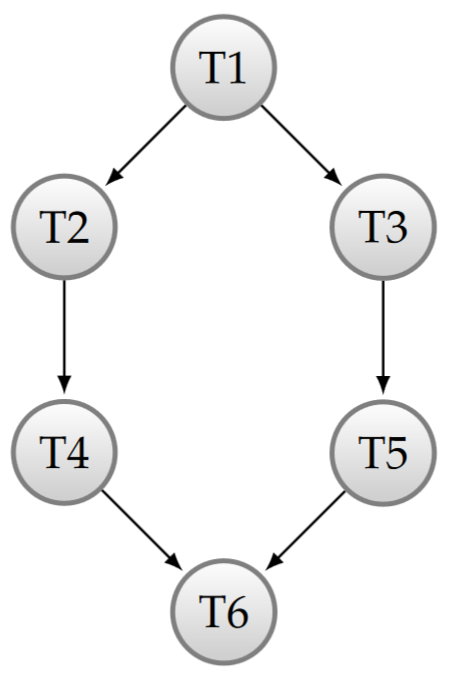

# PCO - Exercices

## Exercice 6

Soit le graphe d’exécution des tâches suivant : 



Les tâches doivent exécuter leur traitement dans l’ordre indiqué par les flèches. En l’occurence la tâche T1 doit être terminée avant que T2 et T3 ne commencent

###Exercice 6 - 1

Ecrire un programme permettant de garantir ce fonctionnement, en utilisant la fonction `QThread::wait()`:

```c++
#include <QCoreApplication>
#include <QThread>
#include <iostream>

using namespace std;
QThread *threads[8];

class T1 : public QThread{
public:
    void run() Q_DECL_OVERRIDE {
        cout << "Tache n°1" << endl;
    }
};

class T2 : public QThread{
public:
    void run() Q_DECL_OVERRIDE {
        threads[0]->wait();
        cout << "Tache n°2" << endl;
    }
};

class T3 : public QThread{
public:
    void run() Q_DECL_OVERRIDE {
        threads[0]->wait();
        cout << "Tache n°3" << endl;
    }
};

class T4 : public QThread{
public:
    void run() Q_DECL_OVERRIDE {

        threads[1]->wait();
        cout << "Tache n°4" << endl;
    }
};

class T5 : public QThread{
public:
    void run() Q_DECL_OVERRIDE {

        threads[1]->wait();
        cout << "Tache n°5" << endl;
    }
};

class T6 : public QThread{
public:
    void run() Q_DECL_OVERRIDE {
        threads[1]->wait();
        cout << "Tache n°6" << endl;
    }
};

class T7 : public QThread{
public:
    void run() Q_DECL_OVERRIDE {
        threads[3]->wait();
        threads[4]->wait();
        threads[5]->wait();
        cout << "Tache n°7" << endl;
    }
};

class T8 : public QThread{
public:
    void run() Q_DECL_OVERRIDE {
        threads[6]->wait();
        threads[2]->wait();
        cout << "Tache n°8" << endl;
    }
};

int main(int argc, char *argv[])
{
    QCoreApplication a(argc, argv);

    threads[0] = new T1();
    threads[1] = new T2();
    threads[2] = new T3();
    threads[3] = new T4();
    threads[4] = new T5();
    threads[5] = new T6();
    threads[6] = new T7();
    threads[7] = new T8();

    for(QThread *cur : threads){
        cur->start();
    }

    return a.exec();
}
```

### Exercice 6 - 2

Faire de même, en utilisant des sémaphores pour la synchronisation :

```c++
#include <QCoreApplication>
#include <QThread>
#include <QSemaphore>
#include <iostream>

using namespace std;
QThread *threads[8];
QSemaphore *semaphores[4];


class T1 : public QThread{
public:
    void run() Q_DECL_OVERRIDE {
        cout << "Tache n°1" << endl;
        semaphores[0]->release();
        semaphores[0]->release();
    }
};

class T2 : public QThread{
public:
    void run() Q_DECL_OVERRIDE {
        semaphores[0]->acquire();
        cout << "Tache n°2" << endl;
        semaphores[1]->release();
        semaphores[1]->release();
        semaphores[1]->release();
    }
};

class T3 : public QThread{
public:
    void run() Q_DECL_OVERRIDE {
        semaphores[0]->acquire();
        cout << "Tache n°3" << endl;
        semaphores[3]->release();
    }
};

class T4 : public QThread{
public:
    void run() Q_DECL_OVERRIDE {
        semaphores[1]->acquire();
        cout << "Tache n°4" << endl;
        semaphores[2]->release();
    }
};

class T5 : public QThread{
public:
    void run() Q_DECL_OVERRIDE {
        semaphores[1]->acquire();
        cout << "Tache n°5" << endl;
        semaphores[2]->release();
    }
};

class T6 : public QThread{
public:
    void run() Q_DECL_OVERRIDE {
        semaphores[1]->acquire();
        cout << "Tache n°6" << endl;
        semaphores[2]->release();
    }
};

class T7 : public QThread{
public:
    void run() Q_DECL_OVERRIDE {
        semaphores[2]->acquire();
        semaphores[2]->acquire();
        semaphores[2]->acquire();
        cout << "Tache n°7" << endl;
        semaphores[3]->release();
    }
};

class T8 : public QThread{
public:
    void run() Q_DECL_OVERRIDE {
        semaphores[3]->acquire();
        semaphores[3]->acquire();
        cout << "Tache n°8" << endl;
    }
};

int main(int argc, char *argv[])
{
    QCoreApplication a(argc, argv);

    for(size_t i = 0; i < 4; ++i){
        semaphores[i] = new QSemaphore(0);
    }

    threads[0] = new T1();
    threads[1] = new T2();
    threads[2] = new T3();
    threads[3] = new T4();
    threads[4] = new T5();
    threads[5] = new T6();
    threads[6] = new T7();
    threads[7] = new T8();

    for(QThread *cur : threads){
        cur->start();
    }

    return a.exec();
}
```

## Exercice 7

Soit le graphe d’exécution des tâches suivant : 



Les tâches doivent exécuter leur traitement dans l’ordre indiqué par les flèches.

###Exercice 7 - 1

Ecrire un programme permettant de garantir ce fonctionnement, en utilisant la fonction `QThread::wait()`

```c++
#include <QThread>
#include <iostream>

QThread* threads[6];

class T1 : public QThread
{
    void run() Q_DECL_OVERRIDE
    {

        std::cout << "Task 1" << std::endl;

    }
};

class T2 : public QThread
{
    void run() Q_DECL_OVERRIDE
    {
        threads[0]->wait();
        std::cout << "Task 2" << std::endl;

    }
};

class T3 : public QThread
{
    void run() Q_DECL_OVERRIDE
    {
        threads[0]->wait();
        std::cout << "Task 3" << std::endl;

    }
};


class T4 : public QThread
{
    void run() Q_DECL_OVERRIDE
    {
        threads[1]->wait();
        std::cout << "Task 4" << std::endl;

    }
};

class T5 : public QThread
{
    void run() Q_DECL_OVERRIDE
    {
        threads[2]->wait();
        std::cout << "Task 5" << std::endl;

    }
};

class T6 : public QThread
{
    void run() Q_DECL_OVERRIDE
    {
        threads[3]->wait();
        threads[4]->wait();
        std::cout << "Task 6" << std::endl;

    }
};

int main(int ,char *[])
{
    threads[0] = new T1();
    threads[1] = new T2();
    threads[2] = new T3();
    threads[3] = new T4();
    threads[4] = new T5();
    threads[5] = new T6();

    for(int i=0; i< 6; i++)
        threads[i]->start();

    threads[5]->wait();
}
```

###Exercice 7 - 2

Faire de même, en utilisant des sémaphores pour la synchronisation.

```c++
#include <QThread>
#include <QSemaphore>
#include <iostream>

QThread* threads[6];
QSemaphore* semaphores[4];

class T1 : public QThread
{
    void run() Q_DECL_OVERRIDE
    {

        std::cout << "Task 1" << std::endl;
        semaphores[0]->release();
        semaphores[0]->release();
    }
};

class T2 : public QThread
{
    void run() Q_DECL_OVERRIDE
    {

        semaphores[0]->acquire();
        std::cout << "Task 2" << std::endl;
        semaphores[1]->release();

    }
};

class T3 : public QThread
{
    void run() Q_DECL_OVERRIDE
    {
        semaphores[0]->acquire();
        std::cout << "Task 3" << std::endl;
        semaphores[2]->release();
    }
};

class T4 : public QThread
{
    void run() Q_DECL_OVERRIDE
    {

        semaphores[1]->acquire();
        std::cout << "Task 4" << std::endl;
        semaphores[3]->release();

    }
};

class T5 : public QThread
{
    void run() Q_DECL_OVERRIDE
    {
        semaphores[2]->acquire();
        std::cout << "Task 5" << std::endl;
        semaphores[3]->release();
    }
};

class T6 : public QThread
{
    void run() Q_DECL_OVERRIDE
    {
        semaphores[3]->acquire();
        semaphores[3]->acquire();
        std::cout << "Task 6" << std::endl;

    }
};

int main(int ,char *[])
{
    threads[0] = new T1();
    threads[1] = new T2();
    threads[2] = new T3();
    threads[3] = new T4();
    threads[4] = new T5();
    threads[5] = new T6();

    for(int i=0; i<4; i++){
        semaphores[i] = new QSemaphore(0);
    }

    for(int i=0; i< 6; i++)
        threads[i]->start();

    threads[5]->wait();
}
```

## Exercice 10

Réaliser un verrou à base de sémaphores. La sémantique du verrou doit évidemment être préservée. Le verrou aura l’interface suivante :

```c++
class PcoMutex
{
public:
    PcoMutex();
    ~PcoMutex();
    void lock();
    void unlock();
    bool trylock(); //! 	Returns true if the mutex can be acquired, false if it is 							already locked
};
```

**Solution**

```c++
#ifndef PCOMUTER_QT_H
#define PCOMUTER_QT_H
#include <QSemaphore>
#include <iostream>

class PcoMutex
{
    QSemaphore* mutex;
    QSemaphore* attente;

    int nbThreadWaiting;
    bool occupied;
public:
    PcoMutex() : occupied(false), nbThreadWaiting(0), mutex(new QSemaphore(1)), attente(new QSemaphore(0))
    {

    }

    ~PcoMutex()
    {
        delete attente;
        delete mutex;
    }

    void lock()
    {
        mutex->acquire();

        if(occupied){

            nbThreadWaiting++;
            mutex->release();
            attente->acquire();
        }else{
            occupied = true;
            mutex->release();
        }
    }

    void unlock()
    {
        mutex->acquire();
        if(occupied){
            if (nbThreadWaiting>0) {
                nbThreadWaiting--;
                attente->release();
            }
            else {
                occupied = false;
            }
        }
        mutex->release();
    }

    /**
    //! Returns true if the mutex can be acquired, false if it is already locked
    */
    bool trylock()
    {
        mutex->acquire();
        if (occupied) {
            mutex->release();
            return false;
        }
        else {
            occupied = true;
            mutex->release();
            return true;
        }
    }  
};

#endif // PCOMUTER_QT_H
```

## Exercice 11

Nous sommes intéressés à la réalisation d’une barrière de synchronisation. Une telle barrière fonctionne de la manière suivante :
Pour une barrière initialisée à N, les N -1 threads faisant appel à la méthode wait seront bloqués.
Lorsque le Nème thread appel wait, tous les threads sont relâchés et peuvent poursuivre leur exécution.

La barrière aura l’interface suivante :

```c++
class PcoBarrier
{
public:
    PcoBarrier(unsigned int nbToWait);
    ~PcoBarrier();
    void wait();
};
```

### Semaphores

```c++
#include <QSemaphore>

class PcoBarrier
{
    QSemaphore mutex;
    QSemaphore attente;
    size_t nbToWait;
    size_t nbWaiting;

public:
    PcoBarrier(size_t nbToWait) :  nbToWait(nbToWait), nbWaiting(0),mutex(1), attente(0)
    {
    }

    ~PcoBarrier()
    {
    }

    void wait()
    {
        mutex.acquire();
        nbWaiting++;
        if(nbWaiting == nbToWait){
            mutex.release();
            for(size_t i = 0; i < nbToWait-1; i++){
                attente.release();
            }

        } else {
            mutex.release();
            attente.acquire();
        }
    }
};
```

### Mesa

```c++
#include <QMutex>
#include <QWaitCondition>

class PcoBarrier
{
    QMutex mutex;
    QWaitCondition cond;
    size_t nbToWait, nbWaiting;

public:
    PcoBarrier(size_t nbToWait): nbToWait(nbToWait), nbWaiting(0)
    {
    }

    ~PcoBarrier()
    {
    }

    void wait()
    {
        mutex.lock();
        nbWaiting++;
        if(nbWaiting == nbToWait){
            cond.wakeAll();

        } else {
            cond.wait(&mutex);
        }

        mutex.unlock();
    }
};
```

### Hoare

```c++
#include <QSemaphore>
#include "hoaremonitor.h"

class PcoBarrier : public HoareMonitor
{

    Condition cond;
    size_t nbToWait;
    size_t nbWaiting;

public:
    PcoBarrier(unsigned int nbToWait) : nbToWait(nbToWait), nbWaiting(0)
    {
    }

    ~PcoBarrier()
    {
    }

    void wait()
    {
        monitorIn();
        nbWaiting++;
        if((nbToWait )== nbWaiting){
            for(int i = 0; i < nbToWait -1; i++)
                signal(cond);
        } else {
            MoniWait(cond);
        }

        monitorOut();
    }
};
```

## Question 12

Nous désirons contrôler l’accès à un pont suspendu. Ce pont est capable de supporter un poids
de maxWeight tonnes. Une voiture pèse 1 tonne, et un camion 10 tonnes. En considérant que les voitures et camions arrivant devant le pont sont modélisés par des threads, et que le pont est une ressource critique, écrire le code permettant la gestion correcte de l’accès au pont. L’interface du gestionnaire de pont doit être la suivante. Le nombre maxWeight de tonnes supportées par le pont est passé en paramètre du constructeur.

```c++
class BridgeManager {
public:
    BridgeManager(unsigned int maxWeight);
    ~BridgeManager();
    void carAccess();
    void truckAccess();
    void carLeave();
    void truckLeave();
}
```

### Sémaphores

```c++

#include <QSemaphore>

#define CARWEIGHT 1
#define TRUCKWEIGHT 10
class BridgeManager
{
    const size_t maxWeight;
    size_t actualWeight, nbCarWaiting, nbTruckWaiting;
    QSemaphore mutex, bridge;
public:

    BridgeManager(size_t maxWeight) : maxWeight(maxWeight), actualWeight(0), mutex(1), bridge(0), nbCarWaiting(0), nbTruckWaiting(0)
    {

    }

    void carAccess()
    {
        mutex.acquire();
        if(actualWeight + CARWEIGHT <= maxWeight){
            actualWeight += CARWEIGHT;
            mutex.release();
        } else {
            nbCarWaiting++;
            mutex.release();
            bridge.acquire();
            actualWeight += CARWEIGHT;
        }
    }

    void truckAccess()
    {
        mutex.acquire();
        if(actualWeight + TRUCKWEIGHT <= maxWeight){
            actualWeight += TRUCKWEIGHT;
            mutex.release();
        } else {
            nbTruckWaiting++;
            mutex.release();
                bridge.acquire(TRUCKWEIGHT);

            actualWeight += TRUCKWEIGHT;
        }
        mutex.release();

    }

    void carLeave()
    {
        mutex.acquire();
        if(nbCarWaiting > 0){
            nbCarWaiting--;
            bridge.release();
        }
        actualWeight -= CARWEIGHT;

        mutex.release();
    }

    void truckLeave()
    {
        mutex.acquire();
        if(nbTruckWaiting > 0){
            nbTruckWaiting--;

                bridge.release(TRUCKWEIGHT);
        }
        actualWeight -= TRUCKWEIGHT;

        mutex.release();
    }
};
```

### Mesa

```c++
#include <QMutex>
#include <QWaitCondition>

#define CARWEIGHT 1
#define TRUCKWEIGHT 10

class BridgeManager
{

    const size_t maxWeight;
    size_t actualWeight, nbCarWaiting, nbTruckWaiting;
    QMutex mutex;
    QWaitCondition cond;

public:
    BridgeManager(size_t maxWeight) : maxWeight(maxWeight), actualWeight(0), nbCarWaiting(0), nbTruckWaiting(0)
    {

    }

    void carAccess()
    {
        mutex.lock();
        if(actualWeight + CARWEIGHT > maxWeight){
            nbCarWaiting++;
            cond.wait(&mutex);
        }
        actualWeight += CARWEIGHT;
        mutex.unlock();
    }

    void truckAccess()
    {
        mutex.lock();

        if(actualWeight + TRUCKWEIGHT > maxWeight){
            nbTruckWaiting++;
            for(size_t i = 0; i < TRUCKWEIGHT; i++)
                cond.wait(&mutex);
        }

        actualWeight += TRUCKWEIGHT;
        mutex.unlock();
    }

    void carLeave()
    {
        mutex.lock();
        if(nbCarWaiting > 0){
            nbCarWaiting--;
            cond.wakeOne();
        }
        actualWeight -= CARWEIGHT;

        mutex.unlock();
    }

    void truckLeave()
    {
        mutex.lock();
        if(nbTruckWaiting > 0){
            nbTruckWaiting--;
            for(size_t i = 0; i < TRUCKWEIGHT; i++)
                cond.wakeOne();
        }
        actualWeight -= TRUCKWEIGHT;

        mutex.unlock();
    }
};
```

### Hoare

```c++
#include <QSemaphore>
#include "hoaremonitor.h"

#define CARWEIGHT 1
#define TRUCKWEIGHT 10

class BridgeManager : public HoareMonitor
{
    const size_t maxWeight;
    size_t actualWeight, nbCarWaiting, nbTruckWaiting;
    Condition cond;

public:
    BridgeManager(size_t maxWeight) : maxWeight(maxWeight), actualWeight(0), nbCarWaiting(0), nbTruckWaiting(0)
    {

    }

    void carAccess()
    {
        monitorIn();

        if(actualWeight + CARWEIGHT > maxWeight){
            MoniWait(cond);
        }

        actualWeight += CARWEIGHT;
        monitorOut();
    }

    void truckAccess()
    {
        monitorIn();

        while(actualWeight + TRUCKWEIGHT > maxWeight){
            MoniWait(cond);
        }

        actualWeight += TRUCKWEIGHT;
        monitorOut();

    }

    void carLeave()
    {
        monitorIn();
        actualWeight -= CARWEIGHT;
        signal(cond);

        monitorOut();

    }

    void truckLeave()
    {
        monitorIn();

        actualWeight -= TRUCKWEIGHT;
        signal(cond);

        monitorOut();
    }
};
```

## Question 15

Nous désirons réaliser un tampon simple dont le fonctionnement implique que chaque donnée qui y est placée doit être consommée par 2 consommateurs. L’interface de ce buffer sera la suivante :

```
template<typename T> class Buffer2Conso : public
	AbstractBuffer<T> {
public:
    Buffer2Conso();
    virtual ~Buffer2Conso();
    virtual void put(T item);
    virtual T get(void);
};
```

